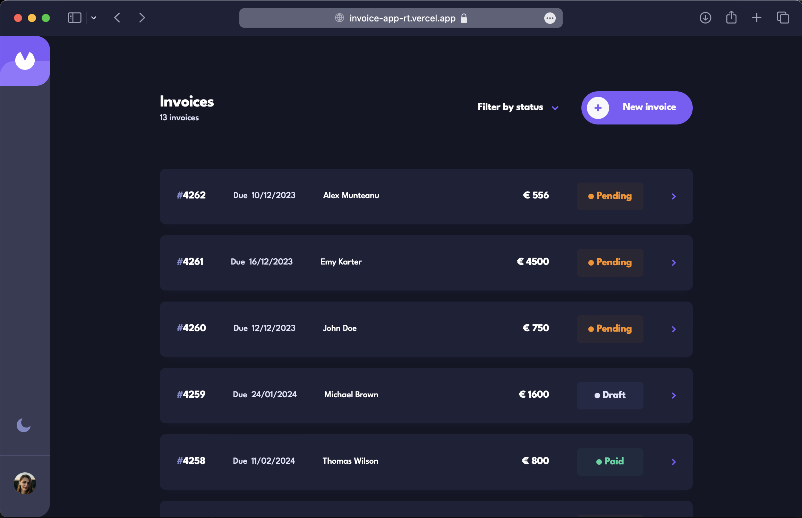

# <a href="https://invoice-app-rt.vercel.app"  target="_blank">Invoice App - React TypeScript / Supabase backend</a>

### <a href="https://invoice-app-rt.vercel.app"  target="_blank">→ See the app: https://invoice-app-rt.vercel.app</a>

 

   This project is for portfolio showcase.

### Source of the UI Design (Figma)

The project UI Design represents a GURU challenge (dificulty level 5/5) on Frontend Mentor, where the <a href="https://www.frontendmentor.io/challenges/invoice-app-i7KaLTQjl" target="_blank">Figma</a> UI Design project can be <a href="https://www.frontendmentor.io/challenges/invoice-app-i7KaLTQjl" target="_blank">downloaded</a> under premium subscription. The entire app has been implemented from 0, without following any tutorial, demonstrating the implementation of a UI Design to a fully functional React App.

## Tech Stack

React • TypeScript • <a href="https://reactrouter.com/en/main" target="_blank">React Router</a> • <a href="https://react-hook-form.com/" target="_blank">React Hook Form </a> • <a href="https://zod.dev/" target="_blank"> Zod </a> • <a href="https://fakerjs.dev/" target="_blank">Faker
</a> • <a href="https://tailwindcss.com/" target="_blank">TailwindCSS
</a> • <a href="https://headlessui.com/" target="_blank">Headless UI
</a> • <a href="https://supabase.com/" target="_blank">Supabase</a> • <a href="https://vercel.com/" target="_blank">Vercel</a> •
<a href="https://vitejs.dev/" target="_blank">Vite</a>

## Features

- [x] Built the entire UI components from scratch (minimal use of external libraries).
  - [x] Modals and Slide-Over designed from scratch (no library used).
  - [x] Mobile-first approach.
  - [x] Headless UI has been used just to accelerate the development of popovers and for transitions.
- [x] CRUD Operations: Implemented features for Creating, Updating, and Deleting invoices.
  - [x] Saving a new invoice as Draft or Pending.
  - [x] Change existing invoice status: draft / pending / paid.
  - [x] Edit all the fields of an existing invoice.
  - [x] While performing CRUD operations, UI displays loading state (skeletons, spinner icon in buttons etc).
  - [x] The initial version was developed by performing CRUD operations via fetch API (with local mock API) and then moved to Supabase API.
- [x] Data Validation with Zod: Implemented data validation in forms and CRUD operations using Zod, ensuring data integrity.
- [x] Filter invoices list by status (multiple choice).
  - [x] By using URL params the filter feature is available when the link is shared or accesed directly.
- [x] Routing & Layout: Slide-Over components renders with new route (/new or /invoice/:id/edit), while keeping the in background the previous view.
- [x] Lazy load with Suspense and UI loading feedback with skeletons.
- [x] Backend Integration: Supabase as backend as a service.
  - [x] Authentication: Implemented basic authentication for demonstration purposes (demo user generated on login).
  - [x] Random user profile image assigned to each new demo user.
  - [x] All the data is stored and synced with Supabase Database (PostgreSQL).
- [x] React Hook Form for form management.
- [x] Dark mode.

## Run it locally?

The initial version for CRUD operations was developed using `json-server` library to mock the REST API, which servered the invoice(s) from `db.json` file present in root folder. Then the project was moved to Supabase which required using Supabase's Js library to make CRUD operations (similar to Firebase) together with some env variables for credentials. ENV variables are not provided in the repo due to security reasons, therefor the present setup of the project doesn't provide a "plug & play" experience.

To run the project locally you need to:

- modify the imports to point to `/service/local.InvoicesService.ts` which contains fetch functions, instead of `/service/InvoicesService.ts` which uses Supabase's Js library functions to fetch data.
- make sure json-server library is installed and run `json-server db.json` in a new terminal.

## What could be improved

- [ ] Caching for data fetching using SWR or React Query library
- [ ] useTransition hook to ensure the UI is not blocked while expensive state update is happening
- [ ] Performance: fine tuning the lazy loading and preloading strategies
  - For this project I'm not considering NEXT.js because the scope of the project was to deeply understand the pure React.

## Easter Eggs

Of course. The 13th user profile image that can be assigned to a new demo user is an image of Alex Nedea de la Recorder. Lucky you if you get him (or not?).
